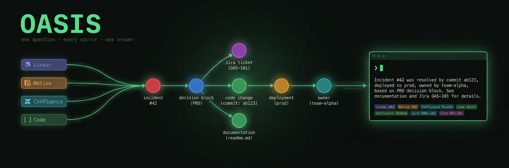

# Oasis, ask one question, four sources (GraphRAG demo)

Ask a plain-language question whose answer is scattered across **Linear, Notion,
Confluence, and the codebase**. Oasis returns one assembled answer that cites all
four. It's **GraphRAG** entities and relationships in a Neo4j graph, so it can
walk the full *incident → decision → code → owner* chain instead of returning a
single fragment. An optional toggle compares it to a plain vector-search baseline
using the **same LLM and prompt**, so the only variable is retrieval.

## Demo question

> **Why does the auth service retry three times, and who owns that decision?**

- **GraphRAG** cites all four: Linear (`INC-231`), Confluence (`ADR-014`), Codebase
  (`MAX_RETRIES = 3`), Notion (owner: Platform Identity / Priya Sharma).
- **Vector baseline** answers the *why* but misses the owner - vector similarity
  never surfaces the Notion page.

## Quickstart

Requires **Python 3.11+**, [uv](https://docs.astral.sh/uv/), **Docker**, and an
`ANTHROPIC_API_KEY` (or `GEN_PROVIDER=openai` + `OPENAI_API_KEY`).

```bash
docker compose up -d                 # Neo4j 5 + APOC (required by ingest)
uv sync                              # create .venv, install locked deps
cp .env.example .env                 # then set ANTHROPIC_API_KEY
uv run python ingest.py              # build the graph + vector store (prints a resolution log)
uv run streamlit run app.py          # open the chat UI
```

Neo4j browser: http://localhost:7474 (neo4j / oasisdemo).

## Using it

It's a chat. Ask a question; follow-ups carry context (ask *"who owns it?"* after
the demo question). Open **config** (top-right) to toggle the vector-baseline
comparison — each answer then gets a *"Compare to plain vector search (k=N)"*
expander — and to set the baseline `top-k`.

Set `ENABLE_GRAPH_VIZ=true` in `.env` to render the traversed subgraph (colour-coded
by entity type) under each answer.

## Adding a data source

Sources are pluggable connectors in `oasis/sources.py`: implement the `Source`
protocol (a `tool` name + `fetch()` returning provenance-tagged docs), append it to
`SOURCES`, and re-run `ingest.py`. Everything downstream is agnostic to where the
documents came from.

## Notes

- **Honest comparison:** both panels use the same `get_llm()` + `build_prompt()`;
  the graph (Neo4j) and vector (Chroma) stores are separate, only retrieval differs.
- **Out of scope** (mocked/skipped): real OAuth connectors, incremental sync,
  permission filtering, and eval harness. The connectors return a fixed in-memory
  corpus standing in for real integrations.
